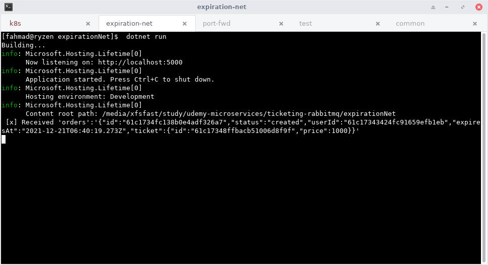
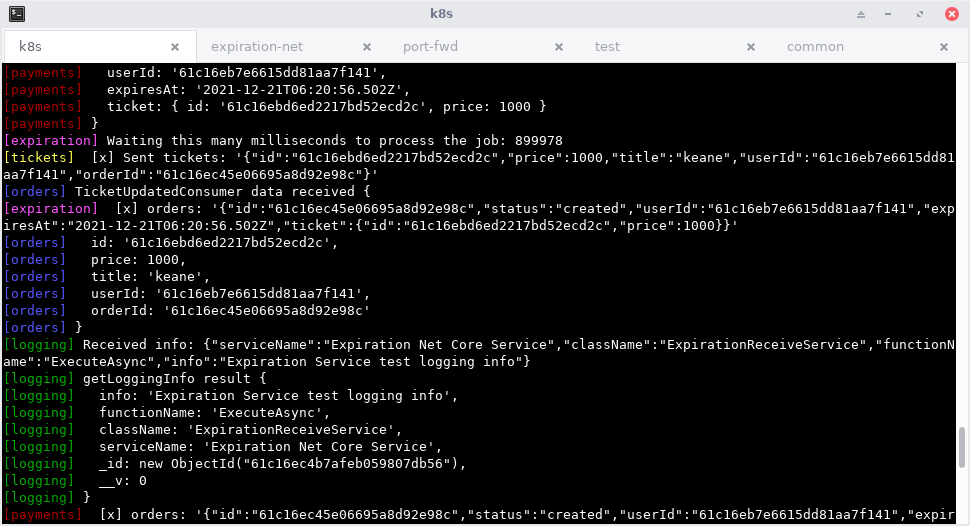

## create .net core 5 app

```shell
dotnet new webapi -o expirationNet --no-https -f net5
```

## install rabbitmq client

```shell
dotnet add package RabbitMQ.Client
```

## create a background service that acts as a rabbit consumer

```c# title="ExpirationReceiveService.cs"
using System;
using System.Text;
using System.Text.Json;
using System.Threading;
using System.Threading.Tasks;
using Microsoft.Extensions.Hosting;
using RabbitMQ.Client;
using RabbitMQ.Client.Events;

namespace expirationNet
{
    public class LoggingInfo
    {
        public string serviceName { get; set; }
        public string className { get; set; }
        public string functionName { get; set; }
        public string info { get; set; }
    }

    public class ExpirationReceiveService : BackgroundService
    {
        private IServiceProvider _sp;
        private ConnectionFactory _factory;
        private IConnection _connection;
        private IModel _channel;
        private string _queueName;

        public ExpirationReceiveService(IServiceProvider sp)
        {
            _sp = sp;
            var rabbitUser = Environment.GetEnvironmentVariable("RABBIT_USER");
            var rabbitPassword = Environment.GetEnvironmentVariable("RABBIT_PASSWORD");
            var rabbitUrl = Environment.GetEnvironmentVariable("RABBIT_URL");

            _factory = new ConnectionFactory()
            {
                UserName = rabbitUser,
                Password = rabbitPassword,
                HostName = rabbitUrl
            };
            _connection = _factory.CreateConnection();
            _channel = _connection.CreateModel();
            _channel.ExchangeDeclare(
                exchange: "order:created",
                type: "direct",
                durable: true
            );
            // _channel.QueueDeclare(queue: "heroes", durable: false, exclusive: false, autoDelete: false, arguments: null);
            var routingKey = "orders";
            _queueName = _channel.QueueDeclare(exclusive: true).QueueName;

            _channel.QueueBind(
                queue: _queueName,
                exchange: "order:created",
                routingKey: routingKey
            );

        }

        protected override Task ExecuteAsync(CancellationToken stoppingToken)
        {
            if (stoppingToken.IsCancellationRequested)
            {
                _channel.Dispose();
                _connection.Dispose();

                return Task.CompletedTask;
            }

            var consumer = new EventingBasicConsumer(_channel);
            consumer.Received += (model, ea) =>
            {
                var body = ea.Body.ToArray();
                var message = Encoding.UTF8.GetString(body);
                var routingKey = ea.RoutingKey;


                var loggingData = new LoggingInfo
                {
                    serviceName = "Expiration Net Core Service",
                    className = "ExpirationReceiveService",
                    functionName = "ExecuteAsync",
                    info = "Expiration Service test logging info"
                };
                var sendThisBody = Encoding.UTF8.GetBytes(
                    JsonSerializer.Serialize(loggingData)
                );
                _channel.BasicPublish(exchange: "logging:info", routingKey: "logging", body: sendThisBody);
                Console.WriteLine(" [x] Received '{0}':'{1}'",
                                  routingKey, message);
            };

            _channel.BasicConsume(
                queue: _queueName,
                autoAck: true,
                consumer: consumer
            );


            return Task.CompletedTask;
        }
    }
}
```

in `Startup.cs`, register the service

```c# title="Startup.cs"
public void ConfigureServices(IServiceCollection services)

    ...

    services.AddHostedService<ExpirationReceiveService>();

    ...
}
```

## `dotnet run`

### port forward rabbitmq

```shell
kubectl port-forward rabbit-server-0 5672:5672
```

### background service part

change the following lines

```c#
var rabbitUser = Environment.GetEnvironmentVariable("RABBIT_USER");
var rabbitPassword = Environment.GetEnvironmentVariable("RABBIT_PASSWORD");
var rabbitUrl = Environment.GetEnvironmentVariable("RABBIT_URL");
```

to

```c#
var rabbitUser = "theUserName";
var rabbitPassword = "thePassword";
var rabbitUrl = "localhost";
```

### run it

```shell
dotnet run
```

### run the rest of services with skaffold

```shell
skaffold dev
```

expirationNet receives data



log published by expirationNet



## references

https://dotnet.microsoft.com/en-us/learn/aspnet/microservice-tutorial/intro

[.NET/C# Client API Guide](https://www.rabbitmq.com/dotnet-api-guide.html#connecting)

[Integrating RabbitMQ with ASP.NET Core - Quickstart with an Example](https://referbruv.com/blog/posts/integrating-rabbitmq-with-aspnet-core-quickstart-with-an-example)
